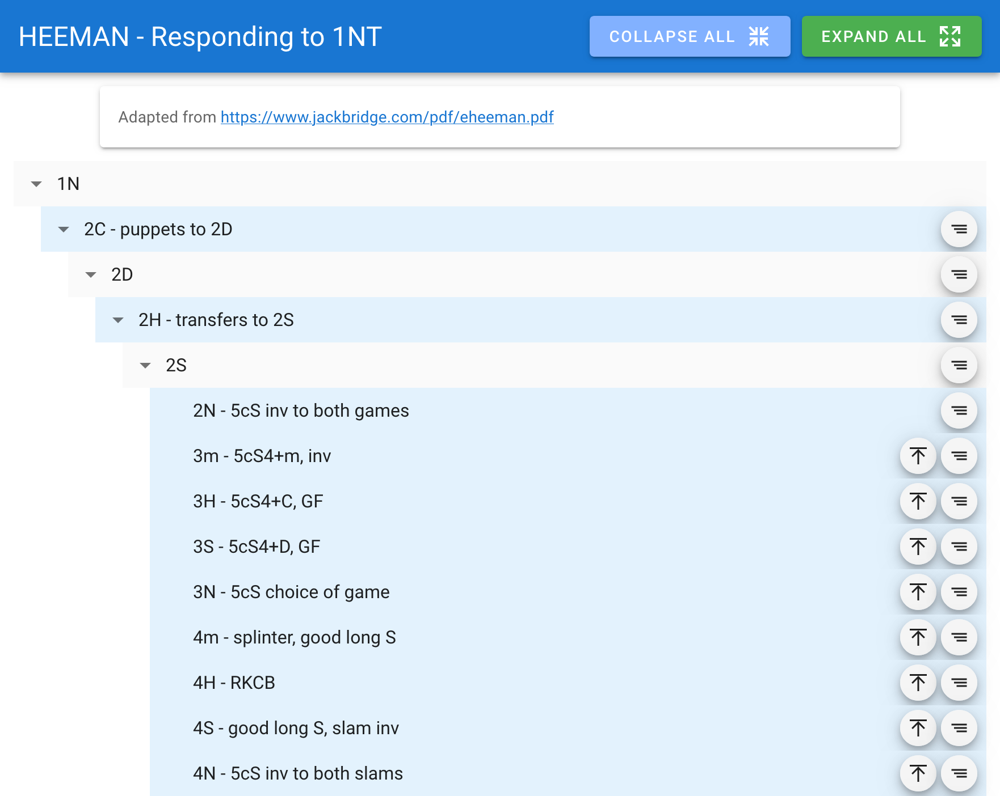

# Bidding System As Code

Your agreements don't end with filling in the convention card.

That neat little grid can't capture what happens
after a support double, or even after 2/1 GF -
does the 2M rebid promise an extra card, or is that catch-all?

Without explicit agreements, you're both guessing[^1].
You need to write down what your bids actually mean. All of them.[^2]
When you and partner remember different versions of your agreements,
you need a single source of truth detailed enough to settle the argument.

Your convention card is nowhere near big enough for that.

[^1]: If your guesses usually match your partner's,
you have implicit agreements - a mess for active ethics;
if your guesses don't match, you give IMPs away.
The latter is better, to be honest.

[^2]: The foreword to [Revision Club](https://bridgewithdan.com/resources/#:~:text=Revision%20Club,strong%20club%20ever)
makes this argument at length. Worth reading even if you have zero interest in strong club systems.

## Why Code

I have long wanted to document EVERY method that I use in bridge bidding.
Pen and paper, plain text file, or word processors[^3] -
every attempt ended with the document collapsing under its complexity[^4].

[^3]: Not Just MS Word or Google Docs, I got furthest with TeXmacs - criminally underrated software.

[^4]: or my lack of willpower, idk

#### What's so hard about writing bidding systems?

- Versioning hell. You change one agreement and suddenly
  can't remember if you're playing the Tuesday version or
  the one from last month's disaster.

- Messy similarity.
  Bidding sequences are often similar but not identical.
  They are usually described in one of two ways:
  - Spell out every sequence in detail.\
    The differences can be overlooked when buried inside duplicative listings.
  - Handwave with the word "similarly".\
    The reader (and maybe the writer as well!) might not fully consider the sequences,
    especially where they differ.

- Flattened bidding tree.
  Bidding branches, text flows linearly.
  Going to any specific sequence requires a lot of scrolling.

Switching to code solves all that, and more:

- Version controlled. `git` shows exactly what is modified and when. Automatic change log.
  Imagine pointing to a commit and say "we swapped these two bids 5 months ago
  because you wanted to make the strong hand declarer."
- Elegant symmetry.
  In code, we concretely specify all sequences - see the Heeman example below.
  Conditional logic explicitly highlights where they differ.[^5]
  When the code is executed, we get all the sequences spelled out.
  Two for the price of one.
- Non-sequential reading.
  Jump directly to definitions or usages of sequences without hunting through pages of text,
  because [Code is HyperText](https://medium.com/@georgeleung_7777/code-is-hypertext-ecf11f93a531).
- Separation of content and styling. You write your system in a clean [DSL](dsl/README.md)
  ([domain-specific language](https://kotlinlang.org/docs/type-safe-builders.html));
  it outputs a JSON tree for an HTML viewer.
- IDE auto-formatting, as long as braces match. (BTW, fuck YAML)

[^5]: A meticulous writer might do the same in prose,
but they'd be specifying differences in verbose natural language that
you'd have to execute in your head.

## HTML Viewer

Features:

- Collapse and expand.
- Colour-coding the bidder: blue and grey for NS; orange and red for EW.
  No more confusion about whose bid it is in a deep sequence.
- Context on hover: see the whole sequence at a glance, no matter how deep you are in the bidding tree.

Demo: [Fantunes](https://phisgr.github.io/bridge/fantunes/),
[Heeman](https://phisgr.github.io/bridge/heeman/),
[Transfer Lebensohl](https://phisgr.github.io/bridge/xfer-leb/)

### Examples

The [text file of the Fantunes system by Dan](https://bridgewithdan.com/wp-content/uploads/2019/07/Fantoni_Nunes.txt)
is translated to [code](dsl/src/test/kotlin/fantunes/fantunes.kt).
The [output HTML viewer](https://phisgr.github.io/bridge/fantunes/) allows you to explore the system interactively.

The Fantunes example merely reformatted the text file in code.
We got a nice interactive viewer for the hard work,
but the power of code really shines through when we have similar sequences.
For example, Jacoby transfers for the two major suits can be written once:

```kt
"1N" - "15-17 balanced" {
    "2C" - "Stayman"

    // equivalent to writing
    // "2D" - "transfer, 5+H" { ... }
    // "2H" - "transfer, 5+S" { ... }
    Major.suits.forEach { M ->
        "2${M.red}" - "transfer, 5+$M" {
            "2$M" - {
                "2N" - "invite to both games"
                // ...
            }
        }
    }
}
```

For a bigger example, see the [Heeman 1NT response structure](dsl/src/test/kotlin/heeman/heeman.kt),
and compare that to [the PDF](http://www.jackbridge.com/pdf/eheeman.pdf).
This response structure cleverly uses similar sequences for similar hand shapes,
greatly reducing memory burden.
For example, by reaching 3C in 4 different ways, responder can show 5H4C, 5S4C, 4H5C, or 4S5C.
In code, this 4-fold symmetry is written only once. Any asymmetry becomes obvious:

```kt
/**
 * The four-fold symmetry sequence.
 * The sequence [isFast] if responder's first bid is a transfer to [M],
 * i.e. it does not go through 2C-2D.
 */
private fun BiddingTree.symmetric(isFast: Boolean, M: Major) {
    val majorHolding = "${if (isFast) 4 else 5}c$M"
    val minorLength = if (isFast) 5 else 4

    "2N" - "$majorHolding inv to both games"
    "3m" - "$majorHolding$minorLength+m, inv"

    // ...

    val suitQuality = if (isFast) "weak" else "good"
    "4m" - "splinter, $suitQuality long $M"
    when (M) {
        // no way to show spade splinter with long H
        H if isFast -> "4S" - "undefined"
        // no way to show S suit quality when the splinter suit is H, as slow 4H is RKCB
        S if isFast -> "4H" - "splinter, long $M"
        else -> "4${other(M)}" - "RKCB"
    }
    "4$M" - "$suitQuality long $M, slam inv"
}
```

The `when` clause draws your attention to the fact that
there's no way to show the S suit quality when the splinter suit is H.
I played Heeman for months without noticing this
because it was buried in the repetitive listings.[^6]

Here is the slow and fast branches for spades in the viewer:\
\


[^6]: A lesson we learned in software engineering:
"You basically can't pay people enough to carefully review dull code."

## Licensing Note

The output HTML embeds software licensed under AGPLv3.
Redistribution under restrictive terms may create compliance complexities
best avoided through open distribution.
